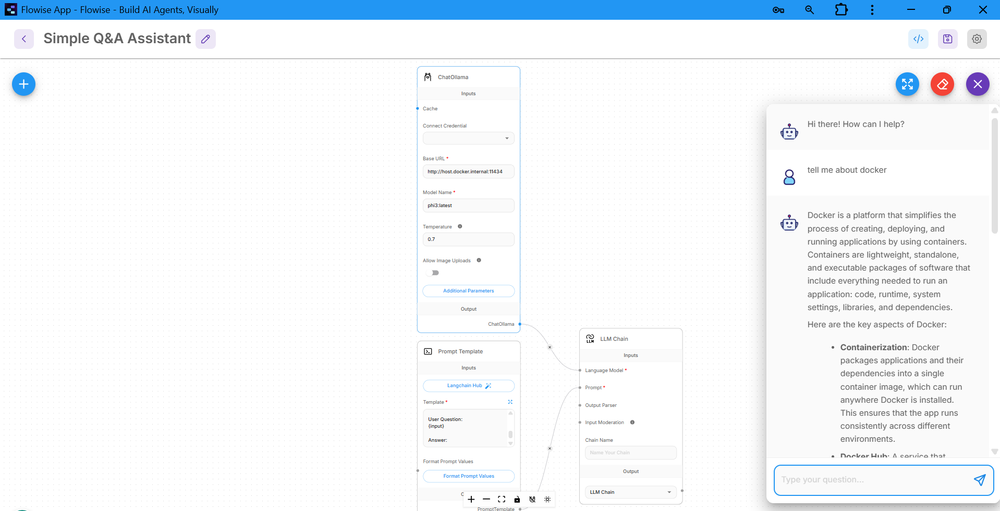
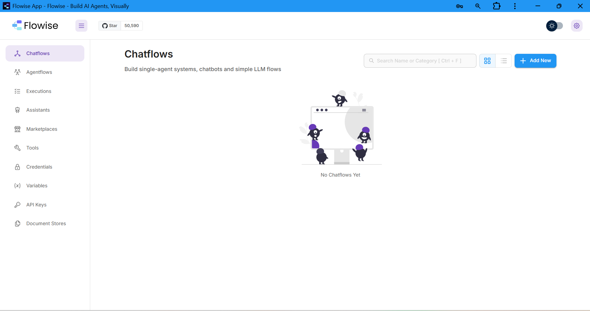
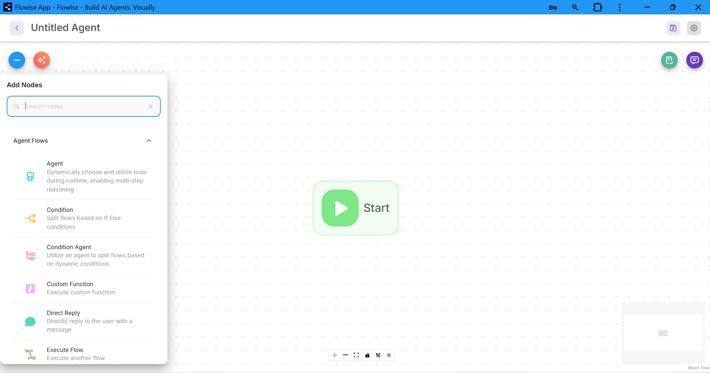
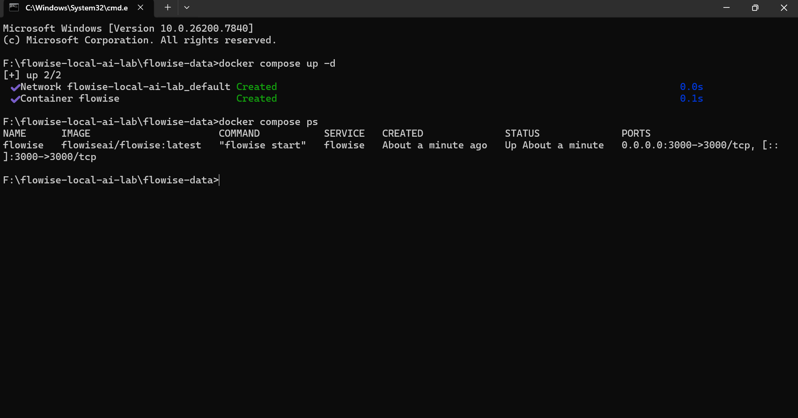
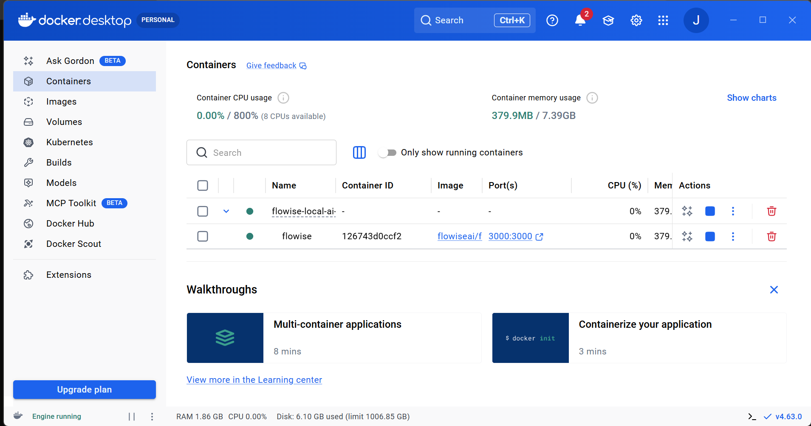
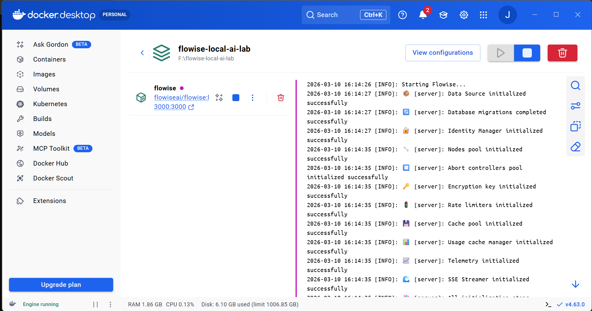

# Flowise Local AI Lab


A local environment to build AI agents using **Flowise + Docker + WSL2**.

This project provides a simple setup for running Flowise locally using Docker Compose, allowing developers to build and test AI agents without relying on cloud infrastructure.

---

## Features

- Run Flowise locally
- Containerized with Docker
- Easy setup using Docker Compose
- No cloud dependency
- Visual AI agent workflow builder

---

## Requirements

- Docker Desktop
- WSL2 (Windows Subsystem for Linux)

---

## Architecture

The system runs Flowise inside a Docker container using WSL2 as the Linux environment.

```
Windows
   │
   ├── WSL2
   │
   ├── Docker Engine
   │
   └── Flowise Container
         │
         └── Web UI (http://localhost:3000)
```

---

## Setup

Clone the repository

```bash
git clone https://github.com/Jay-7374/flowise-local-ai-lab.git
```

Move into the project folder

```bash
cd flowise-local-ai-lab
```

Start Flowise

```bash
docker compose up -d
```

Open Flowise in your browser

```
http://localhost:3000
```

---

## Demo AI Agent

Example AI assistant workflow built using Flowise's visual workflow editor.



---

## Workflow Export

The example agent workflow can be imported directly into Flowise.

File:

```
demo-ai-agent.json
```

To import in Flowise:

1. Open Chatflows
2. Click **Import Chatflow**
3. Upload the JSON file

---

## Screenshots

### Flowise Dashboard



### Flowise Agent Builder



### Flowise Container Running



### Docker Container View



### Docker Logs



---

## Stop the Service

To stop the Flowise container:

```bash
docker compose down
```

---

## Project Structure

```
flowise-local-ai-lab
│
├── docker-compose.yml
├── README.md
├── setup-guide.md
└── screenshots
      ├── flowise-dashboard.png
      ├── flowise-agent-builder.png
      ├── flowise-container-running.png
      ├── docker-container-view.png
      ├── docker-logs.png
      └── flowise-demo-agent.png
```

---

## Tech Stack

- Docker
- Docker Compose
- Flowise
- WSL2

---

## License

This project is for learning and experimentation purposes.
